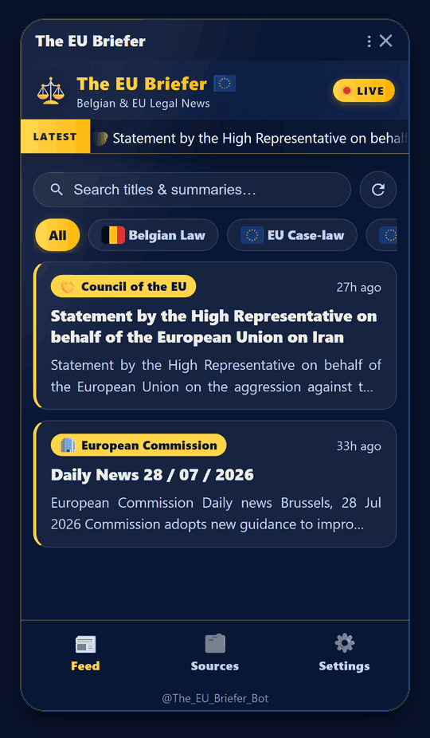
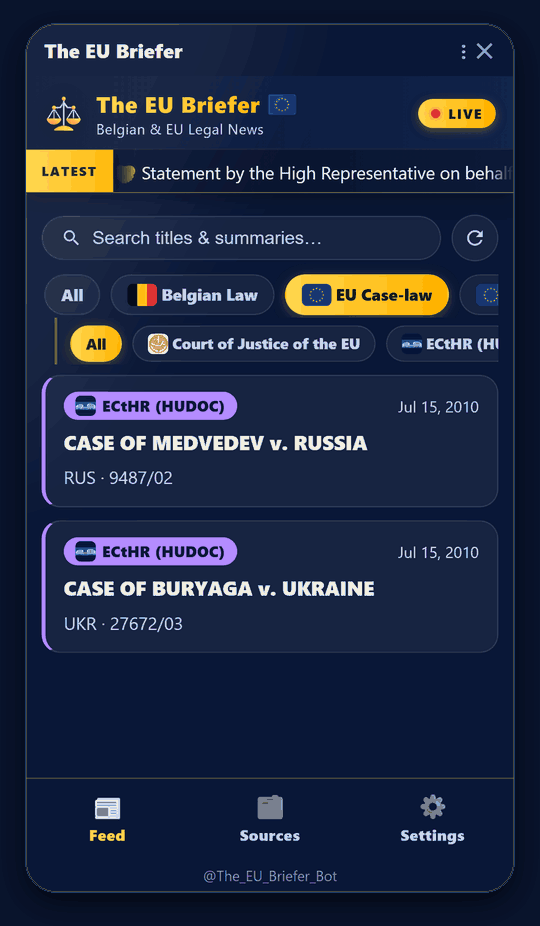
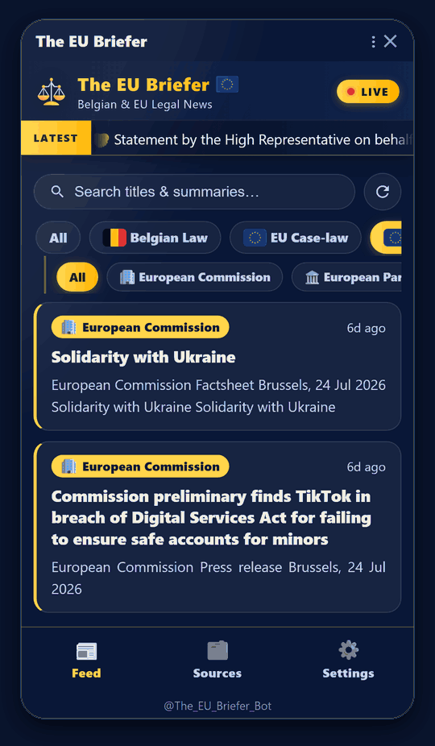
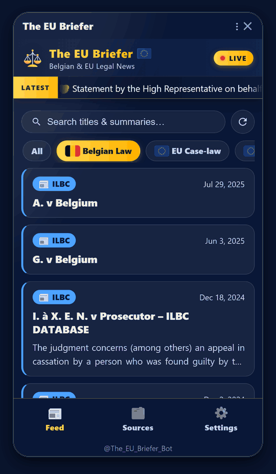
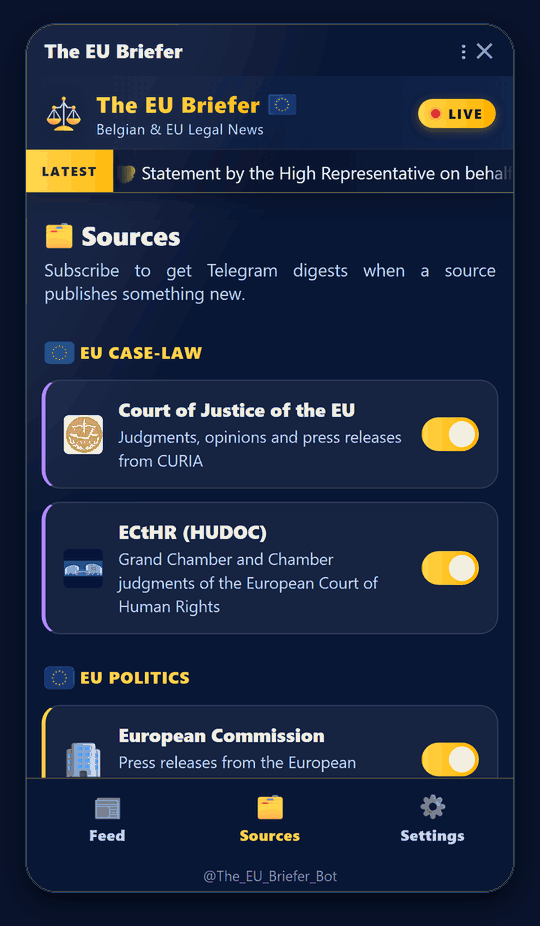
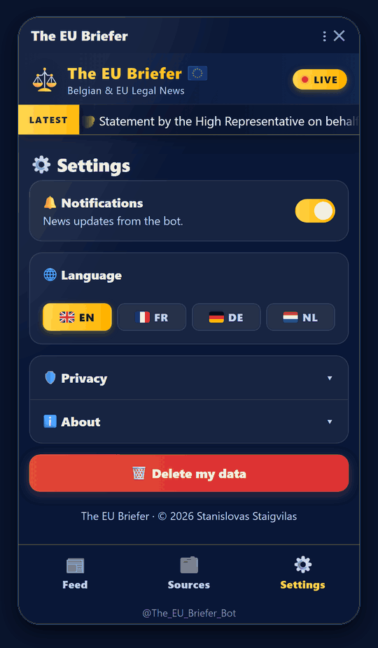
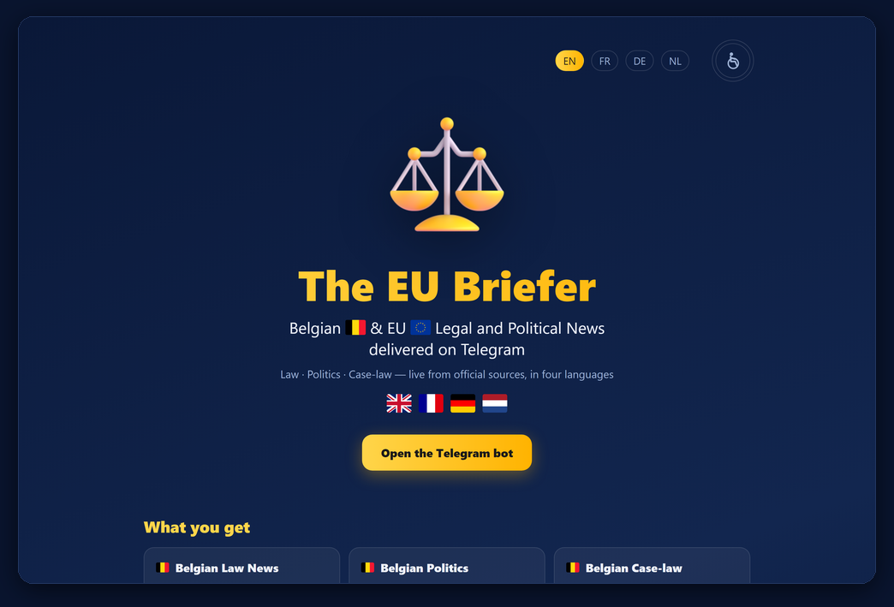

# The EU Briefer

**Belgian and EU legal news, delivered inside Telegram.**

English · Français · Deutsch · Nederlands

[**Open the bot →**](https://t.me/The_EU_Briefer_Bot) &nbsp;·&nbsp; [eubriefer.apps.brussels](https://eubriefer.apps.brussels)

---

## Preface

The EU Briefer is a multilingual legal and political intelligence app that
transforms how professionals stay informed about European and Belgian affairs.
Unlike traditional email newsletters and generic news feeds, it delivers
personalised, real-time updates directly via Telegram, ensuring users receive
only the official information that matters most to their selected areas of
interest.

Instead of manually monitoring dozens of institutional websites, users receive
tailored updates from trusted sources such as the Court of Justice of the
European Union (CJEU), the European Court of Human Rights (ECtHR), the Belgian
Constitutional Court, Juportal, the European Commission and the European
Parliament.

Covering legislation, case-law, policy developments and political news in
English, French, Dutch and German, The EU Briefer delivers the right
information, in the right language, at the right time—empowering lawyers,
policymakers, businesses and researchers to stay ahead in an increasingly
dynamic legal and regulatory environment.

---

## Getting started

**1.** Open Telegram and search for **@The_EU_Briefer_Bot** — or simply tap
[this link](https://t.me/The_EU_Briefer_Bot).

**2.** Press **Start**.

**3.** Tap **Open** to launch the app.

**4.** Go to **Settings** (bottom right) and choose your language. Leave
**Notifications** on if you would like to hear about new items.

**5.** Go to **Sources** (bottom middle) and switch off anything you do not
need.

**6.** Go to **Feed** (bottom left) and read. Use the buttons along the top to
narrow the list, and tap any card to open the original.

> **Tip:** pull the feed downwards to check for new items straight away.

---

## A look inside

<table>
<tr>
<td width="390" valign="top">

</td>
<td valign="top" align="justify">

### Everything in one feed

Every source you follow, in a single list, newest first.

The gold bar across the top carries the latest headline as it arrives. Each
card below tells you the source, how long ago it landed, and the opening lines
— enough to decide in a second or two whether it concerns you.

Tap a card to open the original document at its official source.

</td>
</tr>

<tr>
<td width="390" valign="top">

</td>
<td valign="top" align="justify">

### EU case-law

Judgments as the courts publish them, from the **Court of Justice of the
European Union** and the **European Court of Human Rights**.

The second row of buttons narrows the list to a single court. Case names and
official reference numbers appear exactly as issued, so anything you find here
can be cited or looked up directly.

</td>
</tr>

<tr>
<td width="390" valign="top">

</td>
<td valign="top" align="justify">

### EU politics

Press releases from the **European Commission** and the **European
Parliament** — proposals, decisions and enforcement actions, published as they
happen.

This is where new obligations tend to surface first, usually well before they
are reported more widely.

</td>
</tr>

<tr>
<td width="390" valign="top">

</td>
<td valign="top" align="justify">

### Belgian law

Belgian judgments from the **ILBC database**, each with the court's own
reference and, where one is published, a short note on what was decided.

Sorted by date, so the most recent rulings are always at the top.

</td>
</tr>

<tr>
<td width="390" valign="top">

</td>
<td valign="top" align="justify">

### Choose what you follow

Every source has its own switch.

Turn one off and it leaves your feed immediately; turn it back on whenever you
like. Nothing is collected on your behalf from a source you have switched off,
so the feed stays as narrow or as broad as you want it.

</td>
</tr>

<tr>
<td width="390" valign="top">

</td>
<td valign="top" align="justify">

### Settings, in your language

Read everything in **English, French, German or Dutch** — one tap switches the
whole app, including the alerts the bot sends you.

Notifications can be turned off at any time. **Privacy** and **About** explain,
in plain terms, what is stored. A single button deletes everything held about
you.

</td>
</tr>
</table>

---

## And on the web

Not everyone starts in Telegram, so there is a public page at
**[eubriefer.apps.brussels](https://eubriefer.apps.brussels)**.

It explains what the service covers, lists the institutions it draws from, and
opens the bot in one tap. The whole page exists in **English, French, German and
Dutch** — the buttons at the top right switch between them, and the one beside
them turns on colour-blind-friendly colours. The Terms are linked at the foot of
the page, in the same four languages.

It is a good link to send to someone who has not seen the service before.

---

**The EU Briefer** · © 2026 Stanislovas Staigvilas · All rights reserved

[Licence](LICENSE.md) &nbsp;·&nbsp; [Terms &amp; Privacy](https://eubriefer.apps.brussels/terms/)

